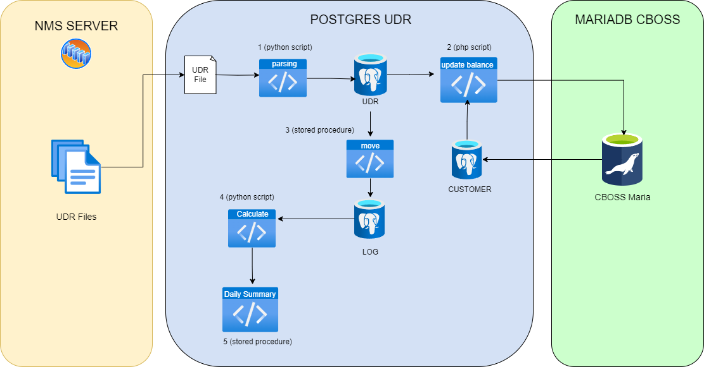

This folder contains project that assist migration UDR processing from ORACLE to POSTGRES.

In this project, we imitate flow and logic from ORACLE (and php script) to processing UDR file.
Furhermore, we changed some php scripts to python scripts.

Quick review of udr flow as follow:
## 0- NMS Server send udr files to POSTGRES server (normally 7 files per minutes)
## 1- Received udr files is parsing by python script and inserted to usa_trx_usage_data_records (UDR) table Postgres table (this run every minutes)
## 2- Update bb_rating.RTR_TRX_SUBSCRIBER_BALANCE at MariaDB CBOSS using usage from UDR table (every minutes), and flag the udr records (STATE = 2)
## 3- After udr records has been fagged, move the records to usa_trx_usage_data_records_log (UDR LOG). This is done every 5 minutes
