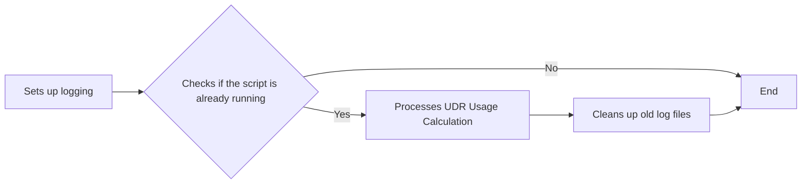
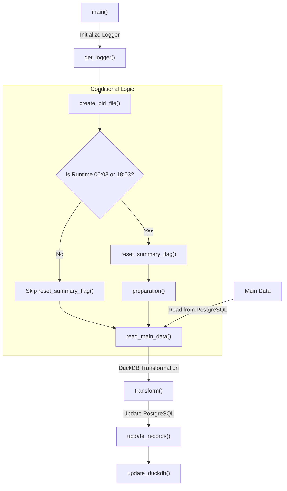

# Postgres Data Processing Script Documentation

## Overview
This script performs a series of data operations, including preparation, transformation, and updates of data stored in PostgreSQL and DuckDB databases. The script logs key operations, handles errors, and sends notifications via Telegram when required.

**Key Features**:
* Establishes connections to PostgreSQL and DuckDB.
* Processes and transforms data.
* Handles database transaction updates.
* Notifies users of events or errors via Telegram.
* Creates PID files for process identification.

**Dependencies**
The following libraries are used in the script:

polars: For data manipulation and reading from databases.
duckdb: To interact with DuckDB.
psycopg2: For PostgreSQL database connections.
requests: For sending HTTP requests (e.g., to Telegram).
dotenv: For loading environment variables.
logging: For logging events and errors.

## Functions
**get_logger()**  
This function initializes a logging system, creating both a stream handler (for console output) and a file handler (logging to a file). The log file is named based on the current date and stored at /ubq_udr/udr_encoder/log/calculate/.

**send_to_telegram(message)**  
This function sends a message to a Telegram bot, notifying the user of key events or errors in the script. The apiToken and chatID are loaded from environment variables.

**create_pid_file(pid_file)**  
This function writes the current process ID (PID) to a file. This can help manage running processes by tracking their status.

**preparation(con, reset_time)**  
This function prepares DuckDB tables by deleting old records based on a reset_time, reducing unnecessary data, and creating necessary tables and macros if required.

**reset_summary_flag(start_time, con, connection, table)** 
This function resets the summary flag for records in PostgreSQL, clearing old summary data so that new calculations can be made.

**get_connection(username, password, port=5432)**  
This function creates a connection to the PostgreSQL database using the credentials provided.

**read_main_data(table_name, cnx)**  
This function retrieves a subset of data from PostgreSQL that is ready for processing. The query selects records that have a terminal status of 'normal' or 'minor' and a summary flag of 0.

**transform(con)**  
This function performs the data transformation process. It applies rules to calculate data usage, handle anomalies, and transform the data accordingly.

**update_duckdb(con)**  
This function updates DuckDB with the transformed data by inserting or updating records.

**update_records(duckdb_conn, table_name, records)**  
This function updates records in PostgreSQL using the transformed data. It retries updates in the event of a deadlock or failed transaction.

**main()**  
The entry point of the script that coordinates the overall process, from creating PID files to resetting summary flags, transforming data, and updating databases.

**Error Handling**  
Errors during database connections or operations are logged and sent to Telegram.
In case of transaction errors (e.g., deadlock), the script retries the update process.

## More details of main logic functions:
### Function Flowchart

The transform(con) function in your script is responsible for performing several data transformation steps. Here's an in-depth breakdown of what it does:

Key Goals of the Function:
Extract a period of interest: The function starts by fetching the minimum and maximum end_date from a main_df table. This defines the time period of interest for which transformations will be applied.

Perform data transformations: The core of the function is to transform the data by comparing current usage records with their corresponding previous records to detect anomalies in user activity. It involves calculating differences in usage values and determining whether the change in values (e.g., data usage or token availability) is anomalous or expected, using a custom macro is_not_anomaly.

Flag anomalies and set calculated fields: The function calculates adjusted usage values for "anytime" and "offpeak" categories, flags anomalies, and prepares the data for insertion into another table or for further use.

Steps in the Function:
Fetching Date Boundaries: The function first gets the minimum and maximum values of end_date from the main_df table, which defines the time period for the data that will be processed.

python
Copy code
con.execute("select min(end_date) from main_df")
min_result = con.fetchone()[0]
con.execute("select max(end_date) from main_df")
max_result = con.fetchone()[0]
These boundaries are logged to provide information on the range of data being processed:

python
Copy code
logging.info(f"end_date period: {min_result.strftime('%Y-%m-%d %H:%M:%S')} - {max_result.strftime('%Y-%m-%d %H:%M:%S')}")
Transformation Query: The main transformation logic is executed inside a WITH clause that creates several intermediate tables or views:

current_process: This view fetches the current records for each user, along with their previous values using the lag() window function. This allows comparing the current and previous values for clock, overall_usage_anytime, overall_usage_offpeak, and overall_available_tokens.

sql
Copy code
with current_proccess as (
    SELECT 
    id, clock, end_date, subscriber_number, terminal_status,
    overall_usage_anytime, overall_usage_offpeak, overall_available_tokens,
    lag(clock) over(partition by SUBSCRIBER_NUMBER order by end_date) as lag_clock,
    lag(OVERALL_USAGE_ANYTIME) over(partition by SUBSCRIBER_NUMBER order by end_date) as lag_usage_anytime,
    lag(OVERALL_USAGE_OFFPEAK) over(partition by SUBSCRIBER_NUMBER order by end_date) as lag_usage_offpeak,
    lag(OVERALL_AVAILABLE_TOKENS) over(partition by SUBSCRIBER_NUMBER order by end_date) as lag_available_tokens
    FROM main_df
    where terminal_status in ('normal','minor')
)
sec_df: This view selects the most recent record from sec_df_duckdb_monthly for each subscriber by using the row_number() window function. This helps in comparing the current record with the last saved record from another dataset.

sql
Copy code
sec_df as (
    select 
    subscriber_number, end_date, clock as clock,
    OVERALL_USAGE_ANYTIME as prev_usage_anytime,
    OVERALL_USAGE_OFFPEAK as prev_usage_offpeak,
    OVERALL_AVAILABLE_TOKENS as prev_available_tokens
    from sec_df_duckdb_monthly
    qualify row_number() over (partition by subscriber_number order by end_date desc) = 1
)
temp: The most important part of the transformation happens here. The data is compared with the previous values (lag_usage_* and prev_usage_*), and if anomalies are detected, certain actions are taken (e.g., setting the usage to 0). The is_not_anomaly macro is used to determine whether the change in usage between two periods is within acceptable limits.

For example, if the overall_usage_anytime value is larger than the previous usage and isn't flagged as anomalous, the usage difference is calculated and stored as v_usage_anytime.

sql
Copy code
temp as (
    select 
    cr.id, cr.subscriber_number, cr.terminal_status, cr.clock, cr.end_date,
    coalesce(cr.lag_clock,cast(prev.clock as int64)) prev_clock,
    cr.overall_usage_anytime,
    coalesce(cr.lag_usage_anytime,cast(prev.prev_usage_anytime as int64),0) prev_usage,
    is_not_anomaly(cr.clock,cr.overall_usage_anytime,prev_clock,prev_usage) is_not_anomaly_usage,
    case when prev_clock is not null 
        then
            case when cr.overall_usage_anytime >= prev_usage
            and is_not_anomaly(cr.clock,cr.overall_usage_anytime,prev_clock,prev_usage)
                then cr.overall_usage_anytime - prev_usage
            else 0 end
        else cr.overall_usage_anytime end as v_usage_anytime,
Final Data Selection: After the transformations in temp, the resulting data is selected and assigned values based on whether the subscriber_number and other fields are valid (i.e., non-null and within valid terminal_status).

The output selects the transformed values, including:

v_usage_anytime
v_usage_offpeak
v_usage_available_tokens
summary_flag (set to 1 for valid records and -1 for invalid ones)
sql
Copy code
select 
case when 
    subscriber_number is not null and 
    coalesce(overall_usage_anytime,overall_usage_offpeak,overall_available_tokens) is not null
    and lower(terminal_status) in ('normal','minor') then
        v_usage_anytime else null 
end as v_usage_anytime,
case when 
    subscriber_number is not null and 
    coalesce(overall_usage_anytime,overall_usage_offpeak,overall_available_tokens) is not null
    and lower(terminal_status) in ('normal','minor') then
        v_usage_offpeak else null 
end as v_usage_offpeak,
case when 
    subscriber_number is not null and 
    coalesce(overall_usage_anytime,overall_usage_offpeak,overall_available_tokens) is not null
    and lower(terminal_status) in ('normal','minor') then
        v_usage_available_tokens else null
end as v_usage_available_tokens,
...
from temp
Logging and Error Handling: After running the transformation query, the function logs the number of rows processed and returns the results. If any error occurs during the transformation, it sends a Telegram notification with the error details and stops the process by closing the connection and exiting the script.

python
Copy code
except Exception as e:
    logging.error(f'Error occured when transforming data with description: {str(e)}')
    send_to_telegram(f'Error occured when transforming data with description: {str(e)}')
    con.close()
    sys.exit(1)
Summary:
Input: Data from main_df, which contains user activity logs, and sec_df_duckdb_monthly, which contains the last saved records of each user.
Transformation: The function compares current and previous records of usage and flags anomalous data. It calculates adjusted values for v_usage_anytime, v_usage_offpeak, and v_usage_available_tokens.
Output: A transformed dataset where each record has a calculated usage, flags for anomalies, and fields indicating the data modification.
Error Handling: In case of any errors, the function logs the error and sends a notification through Telegram

