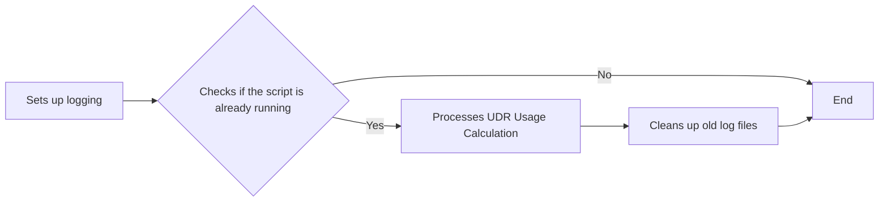
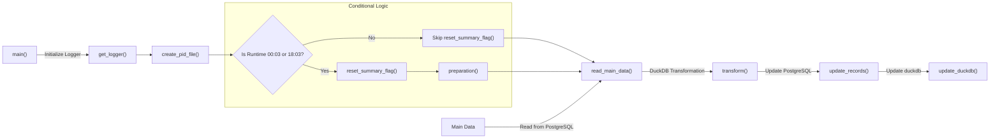

# UDR Log Calculation (Postgres + DuckDB)

## Overview
This script performs a series of data operations, including preparation, transformation, and updates of data stored in PostgreSQL and DuckDB databases. The script logs key operations, handles errors, and sends notifications via Telegram when required.

**Key Features**:
* Establishes connections to PostgreSQL and DuckDB.
* Processes and transforms data.
* Handles database transaction updates.
* Notifies users of events or errors via Telegram.
* Creates PID files for process identification.

**Dependencies**
The following libraries are used in the script:

polars: For data manipulation and reading from databases.
duckdb: To interact with DuckDB.
psycopg2: For PostgreSQL database connections.
requests: For sending HTTP requests (e.g., to Telegram).
dotenv: For loading environment variables.
logging: For logging events and errors.


## Functions
**get_logger()**  
This function initializes a logging system, creating both a stream handler (for console output) and a file handler (logging to a file). The log file is named based on the current date and stored at /ubq_udr/udr_encoder/log/calculate/.

**send_to_telegram(message)**  
This function sends a message to a Telegram bot, notifying the user of key events or errors in the script. The apiToken and chatID are loaded from environment variables.

**create_pid_file(pid_file)**  
This function writes the current process ID (PID) to a file. This can help manage running processes by tracking their status.

**preparation(con, reset_time)**  
This function prepares DuckDB tables by deleting old records based on a reset_time, reducing unnecessary data, and creating necessary tables and macros if required.

**reset_summary_flag(start_time, con, connection, table)** 
This function resets the summary flag for records in PostgreSQL, clearing old summary data so that new calculations can be made.

**get_connection(username, password, port=5432)**  
This function creates a connection to the PostgreSQL database using the credentials provided.

**read_main_data(table_name, cnx)**  
This function retrieves a subset of data from PostgreSQL that is ready for processing. The query selects records that have a terminal status of 'normal' or 'minor' and a summary flag of 0. The output is saved as polars dataframe (*main_df*).

**transform(con)**  
This function performs the data transformation process. It applies rules to calculate data usage, handle anomalies, and transform the data accordingly.

**update_duckdb(con)**  
This function updates DuckDB with the transformed data by inserting or updating records.

**update_records(duckdb_conn, table_name, records)**  
This function updates records in PostgreSQL using the transformed data. It retries updates in the event of a deadlock or failed transaction.

**main()**  
The entry point of the script that coordinates the overall process, from creating PID files to resetting summary flags, transforming data, and updating databases.

**Error Handling**  
Errors during database connections or operations are logged and sent to Telegram.
In case of transaction errors (e.g., deadlock), the script retries the update process.



## More details of main logic functions:
### Function Flowchart


The *transform(con)* function is core step and responsible for performing several data transformation steps. It uses SQL queries to analyze and modify the data for anomaly detection and UDR calculations.

Input
The function takes the following as input:

*con*: A DuckDB connection object to execute SQL commands.  
It reads main_df table (result of *read_main_data()* function) which contains subscriber data including usage statistics such as *overall_usage_anytime*, *overall_usage_offpeak*, and *overall_available_tokens*.

The transformation involves several steps:

* **Extract Data Ranges**: Retrieves the minimum and maximum end_date from main_df to log the processing period.  
    ```sql
    select min(end_date) from main_df;
    select max(end_date) from main_df;
    ```

* **Data Transformation using Window Functions**: The function uses SQL window functions (*lag()*) to calculate the previous values of subscriber data fields (*overall_usage_anytime*, *overall_usage_offpeak*, etc.). This allows the function to compute the difference between the current and previous values for anomaly detection and to calculate usage metrics.
    ```python
    results = con.sql("""
    WITH current_proccess AS (
        ...
    ),
    sec_df AS (
        ...
    ),
    temp AS (
        ...
    )
    SELECT ...
    UNION ALL
    SELECT ...
    """).pl()
    ```
    Let's dive into each CTE:

    + *current_proccess* CTE:
        - Fetches current UDR data from *main_df*.
        - Calculates lagged values using window functions (*lag()*) over *subscriber_number* and ordered by *end_date*.
        - Columns calculated:
            - *lag_clock*
            - *lag_usage_anytime*
            - *lag_usage_offpeak*
            - *lag_available_tokens*
        - Filters records where terminal_status is *normal* or *minor*.

    + *sec_df* CTE:
        - Fetches the most recent record from *sec_df_duckdb_monthly* for each *subscriber_number*  
        **sec_df_duckdb_monthly* is duckdb table that contains previously processed records
        - Uses *QUALIFY ROW_NUMBER() OVER (...) = 1* to select the latest record.

    + *temp* CTE:
        - Joins *current_proccess (cr)* with *sec_df (prev)* on *subscriber_number*.
        - Uses *COALESCE* to handle missing values and assign defaults.
        - Calculates:
            + Previous Values and Anomaly Checks:
                - *prev_clock*: Previous clock value (*lag_clock* or *prev.clock*).
                - *prev_usage*: Previous *overall_usage_anytime* value.
                - *is_not_anomaly_usage*: Checks if the current usage is not an anomaly using the *is_not_anomaly* macro function.

            + Incremental Usage Calculations:
                - v_usage_anytime:
                    + If there is a previous clock value and the current usage is greater than or equal to the previous usage, and it's not an anomaly, then calculate the difference.
                    + If there's no previous clock, use the current *overall_usage_anytime* as the incremental usage.
                ```sql
                CASE
                    WHEN prev_clock IS NOT NULL THEN
                        CASE
                            WHEN cr.overall_usage_anytime >= prev_usage
                            AND is_not_anomaly(cr.clock, cr.overall_usage_anytime, prev_clock, prev_usage) THEN cr.overall_usage_anytime - prev_usage
                        ELSE 0
                        END
                ELSE cr.overall_usage_anytime
                END AS v_usage_anytime

                ```  
                + *v_usage_offpeak*: Similar calculation as *v_usage_anytime* but for *overall_usage_offpeak*.
                + *v_usage_available_tokens*:
                    - Handles cases where tokens have decreased, indicating usage.
                ```sql
                CASE
                    WHEN prev_clock IS NOT NULL THEN
                        CASE
                            WHEN cr.overall_usage_anytime < prev_usage AND cr.overall_usage_offpeak < prev_offpeak AND cr.overall_available_tokens < prev_tokens THEN 0
                            WHEN cr.overall_available_tokens < prev_tokens AND cr.overall_available_tokens <> 0 AND is_not_anomaly(cr.clock, prev_tokens, prev_clock, cr.overall_available_tokens) THEN prev_tokens - cr.overall_available_tokens
                            ELSE 0
                        END
                    ELSE 0
                END AS v_usage_available_tokens
                ```  
+ Anomaly Detection:
    The *is_not_anomaly* macro function is used to detect anomalies in the data. It checks if the difference between the current and previous values is within acceptable limits.
    ```sql
    CREATE MACRO IF NOT EXISTS is_not_anomaly(curr_clock, curr_value, prev_clock, prev_value) AS 
    CASE
        WHEN (curr_value - prev_value) <= (100 * (curr_clock - prev_clock) / 60) AND prev_value >= 0 AND curr_value >= 0 THEN TRUE
        ELSE FALSE
    END
    ```
* **Final Data Preparation:**    
    - Selects the calculated fields from *temp* CTE and applies conditions:
    ```sql
    SELECT
    CASE WHEN conditions THEN v_usage_anytime ELSE NULL END AS v_usage_anytime,
    CASE WHEN conditions THEN v_usage_offpeak ELSE NULL END AS v_usage_offpeak,
    CASE WHEN conditions THEN v_usage_available_tokens ELSE NULL END AS v_usage_available_tokens,
    CASE WHEN conditions THEN 1 ELSE -1 END AS summary_flag,
    CURRENT_DATE AS date_modified,
    'python_duckdb' AS modified_by,
    id,
    end_date
    FROM temp
    UNION ALL
    SELECT
        NULL AS v_usage_anytime,
        NULL AS v_usage_offpeak,
        NULL AS v_usage_available_tokens,
        -1 AS summary_flag,
        CURRENT_DATE AS date_modified,
        'python_duckdb' AS modified_by,
        id,
        end_date
    FROM main_df
    WHERE terminal_status NOT IN ('normal', 'minor')
    ```
    - Assigns *summary_flag* as 1 for processed records and -1 for unprocessed records.

Results of this *tranform()* function is used to update table in Postgres and also inserted to *sec_df_duckdb_monthly* duckdb table for next batch calculation.
