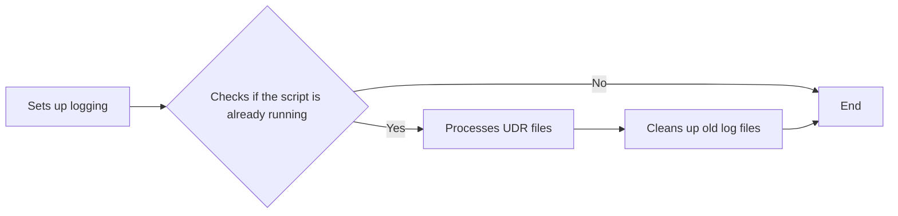

# UDR Encoder Script Documentation

## Overview
This script is designed to process UDR (Usage Data Record) files from specified directories, insert the processed data into a PostgreSQL database, and manage the file movement during and after processing. The script utilizes multi-threading for efficient file processing and implements logging and error handling, including sending notifications via Telegram.

## Functions
**delete_old_file(dir_path)**  
Purpose: Deletes files older than 5 days in the specified directory.
Parameters:
dir_path: The directory to scan for old files.
Functionality:
Recursively searches for files containing a date prefix older than 5 days and removes them.

**create_pid_file(pid_file)**  
Purpose: Creates a PID file to track the running script's process ID.
Parameters:
pid_file: The path where the PID file is created.
Functionality:
Writes the current process ID (PID) into the specified file.

**get_logger(log_file: str)**  
Purpose: Configures and returns a logger to log messages both to the console and to a log file.
Parameters:
log_file: The name of the log file.
Functionality:
Creates a log file using the current date and logs messages with DEBUG level or higher.

**get_connection(username, password, counter, logger, port=5432)**  
Purpose: Establishes a connection to the PostgreSQL database.
Parameters:
username: Database username.
password: Database password.
counter: A counter to identify the thread number.
logger: Logger for logging messages.
port: PostgreSQL port (default is 5432).
Functionality:
Attempts to connect to a PostgreSQL database with retry logic.

**sort_by_modified_time(filename)**  
Purpose: Returns the modification time of a UDR file based on its filename.
Parameters:
filename: The UDR file name.
Functionality:
Extracts the timestamp from the file name and converts it into a datetime object.

**cek_raw_file(logger)**  
Purpose: Reads UDR files from the RAW directory and moves them to the PROC directory for processing.
Parameters:
logger: Logger for logging messages.
Functionality:
Moves a maximum of 35 UDR files from the RAW to the PROC directory.

**cek_proc_file(proc_path, logger)**  
Purpose: Retrieves UDR files from the PROC directory.
Parameters:
proc_path: Directory path where PROC files are located.
logger: Logger for logging messages.
Functionality:
Logs and returns the number of UDR files found in the PROC directory.

**_timestampToDate(timestamp)**  
Purpose: Converts a Unix timestamp into a human-readable date.
Parameters:
timestamp: Unix timestamp.
Functionality:
Converts the timestamp to the format %Y-%m-%d %H:%M:%S.

**_proc_normal(data, logger)**  
Purpose: Processes a UDR file with a "normal" terminal status.
Parameters:
data: The UDR data as a dictionary.
logger: Logger for logging messages.
Functionality:
Extracts key fields from the UDR data and prepares them for database insertion.

**_proc_suspended(data)**  
Purpose: Processes a UDR file with a "suspended" terminal status.
Parameters:
data: The UDR data as a dictionary.
Functionality:
Similar to _proc_normal but processes data with "suspended" terminal status.

**_thread_process(procFile, logger)**  
Purpose: Spawns threads to process multiple UDR files concurrently.
Parameters:
procFile: List of UDR files to process.
logger: Logger for logging messages.
Functionality:
Creates and starts a thread for each UDR file in the PROC directory.
moved_after_insert(filename, proc_path, finish_path, logger)
Purpose: Moves a UDR file from the PROC to the FINISH directory after successful database insertion.
Parameters:
filename: Name of the file to move.
proc_path: Path of the PROC directory.
finish_path: Path of the FINISH directory.
logger: Logger for logging messages.

**is_directory_empty(directory)**  
Purpose: Checks if a directory is empty.
Parameters:
directory: Path of the directory.
Functionality:
Returns True if the directory is empty, otherwise False.

**find_udr_files(directory)**  
Purpose: Finds all UDR files in a given directory.
Parameters:
directory: Path of the directory to search.
Functionality:
Returns a list of UDR files.

**send_to_telegram(message, logger)**  
Purpose: Sends a message to a configured Telegram chat.
Parameters:
message: The message to send.
logger: Logger for logging messages.

**cek_proc_file_is_not_empty(proc_path, logger)**  
Purpose: Checks if the PROC directory is empty and logs any remaining UDR files.
Parameters:
proc_path: Path of the PROC directory.
logger: Logger for logging messages.

**insert_query(results, logger, counter, filename)**  
Purpose: Inserts UDR data into the PostgreSQL database.
Parameters:
results: List of tuples containing UDR data to insert.
logger: Logger for logging messages.
counter: Thread number.
filename: Name of the file being processed.
Functionality:
Inserts data into the PostgreSQL database using an INSERT statement and retries on deadlock or transaction failure.

**process(file, counter, logger)**  
Purpose: Main function to process a UDR file and insert its contents into the database.
Parameters:
file: UDR file to process.
counter: Thread number.
logger: Logger for logging messages.
main() Function
The main() function is the entry point of the script. It performs the following steps:



## More details of main logic functions:  
## Function Flowchart

```mermaid
graph TD;
    A[main#40;#41;] -->|Initialize Logger| B[get_logger#40;#41;];
    A -->|Create PID File| C[create_pid_file#40;#41;];
    A -->|Check RAW Files| D[cek_raw_file#40;#41;];
    D -->|Check PROC Files| E[cek_proc_file#40;#41;];
    E -->|Process Files in Threads| F[_thread_process#40;#41;];
    F -->|Process Each File| G[process#40;#41;];

    G -->|Parse UDR File| H[json.loads#40;#41;];
    G -->|Insert Data| I[insert_query#40;#41;];
    G -->|Move After Insert| J[moved_after_insert#40;#41;];

    A -->|Check PROC Is Empty| K[cek_proc_file_is_not_empty#40;#41;];
    A -->|Delete Old Logs| L[delete_old_file#40;#41;];
    A -->|Remove PID File| M[os.remove&#40;pid_file_path&#41;];

    subgraph File_Processing;
        G --> _proc_normal;
        G --> _proc_suspended;
    end;

    subgraph Database_Interaction;
        I --> get_connection#40;#41;;
    end;
```

**_proc_normal(data, logger)**  
The *_proc_normal* function processes records where the terminalstatus is either normal or minor. It examines whether the usage and capacity values meet specific conditions, then constructs and returns a data dictionary with key fields related to device usage.

Key Steps:  
Extract fields: 
The function extracts important fields from the data dictionary such as serviceplan, esn, and the lastpolledtime.

Usage and Capacity Validation:  
The function checks if either the overallcapacity and overallusage, or the offpeakoverallcapacity and offpeakoverallusage are greater than 1. If these values pass the condition, the record is valid for further processing. If false then skip these records

Data Construction:  
If the conditions are met, the function builds a dictionary (rdata) containing the following fields:
sbcNum: The device's ID.
clock: A timestamp derived from lastpolledtime.
ns: Nanoseconds from lastpolledtime.
endTime: Human-readable timestamp from lastpolledtime.
capacityAnytime: Device's anytime capacity.
capacityOffPeak: Device's off-peak capacity.
overAllUsageAnytime: Device's anytime usage.
overAllUsageOffPeak: Device's off-peak usage.
overAllAvailTokens: Device's available tokens.
fapStatus: FAP (Fair Access Policy) status.
terminalStatus: Current status of the terminal.
inPeakPeriod: Whether the record is in the peak period.
esn: Device ESN (Electronic Serial Number).
spName: Device service plan name.

Return:  
The constructed data is returned if the capacity and usage conditions are met. Otherwise, the function logs the event as "IGNORED."

Purpose:  
This function essentially validates records, ensures they meet usage criteria, and then constructs a well-formatted dictionary of the data for further storage or processing in a PostgreSQL database.

**_proc_suspended(data)**  
The *_proc_suspended* function handles records where the terminalstatus is either critical or suspended. It processes the record into a structured dictionary similar to _proc_normal but is more straightforward since the terminal is in a suspended state.

Key Steps:  
Extract Fields:  
Like _proc_normal, it extracts key information from data such as serviceplan, esn, and lastpolledtime.

Data Construction:  
It builds a dictionary (rdata) containing fields similar to _proc_normal. However, the logic is simplified, since the device's terminal is in a suspended state. The fields include:
sbcNum: Device ID.
clock: Timestamp from lastpolledtime.
ns: Nanoseconds from lastpolledtime.
endTime: Formatted timestamp.
capacityAnytime, capacityOffPeak: Device capacities.
overAllUsageAnytime, overAllUsageOffPeak: Device usage.
overAllAvailTokens: Available tokens.
fapStatus: FAP status.
terminalStatus: Terminal status, which would typically reflect a suspended or critical state.
inPeakPeriod: Peak period information.
esn: Device ESN.
spName: Service plan name.

Handling Empty Nanoseconds:  
If the nanoseconds portion of lastpolledtime is empty (''), it updates the dictionary's ns value to 0. This prevents issues with database constraints, which may require ns to be non-null.

Return:  
The structured data is returned for insertion into the database.

Purpose:  
This function is designed to process records with non-active or critical terminal statuses, ensuring they are handled correctly by building a consistent dictionary that can be stored or processed further. It also ensures any incomplete timestamps are corrected before database insertion.

Summary:  
**_proc_normal**: Processes records where the device's terminal is active and has valid usage data. Constructs and returns a detailed dictionary of device status, capacity, and usage for further processing.  
**_proc_suspended**: Handles records where the device is in a suspended or critical state. It builds a simpler dictionary and ensures the data is clean before storing or processing further.